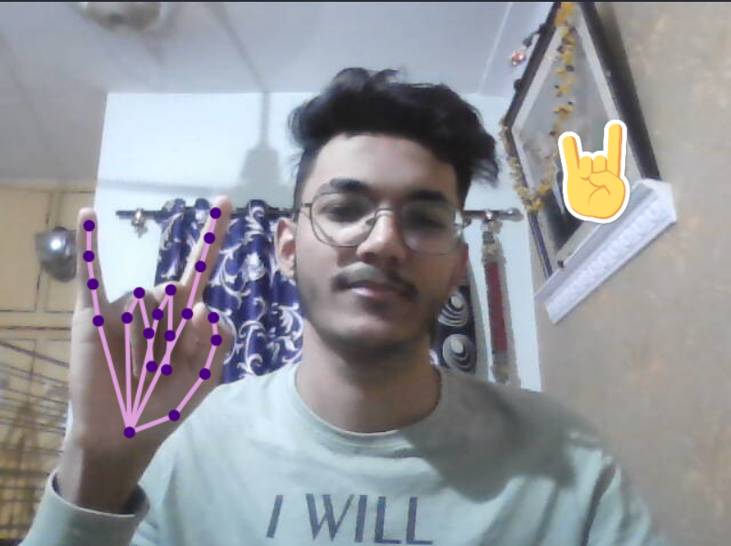
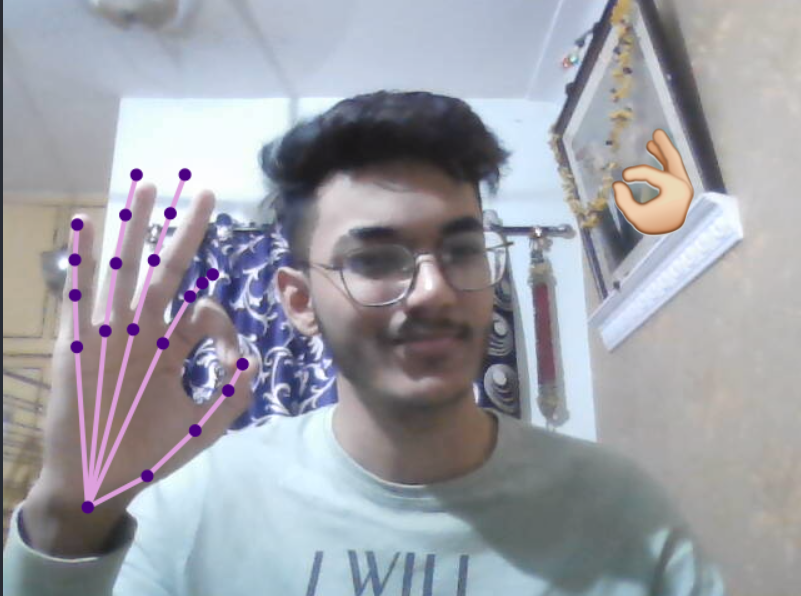
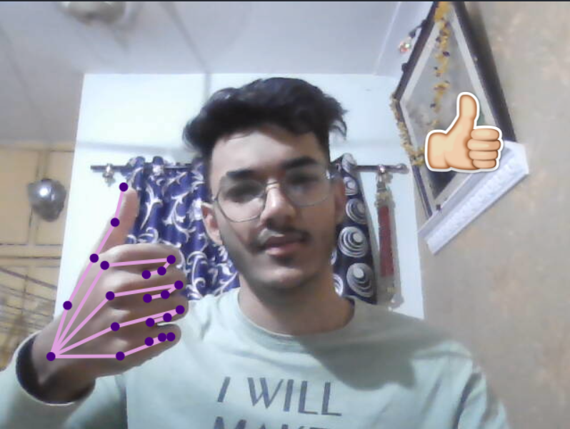

# Gesture Detection with TFJS Handpose and Fingerpose.
Estimates all the finger joints and detects gestures.

## Click <a href="https://akrypt.github.io/handpose/" target="_blank">here</a> to try it out!

Gestures which can be estimated: Thumbs Up 👍, Ok 👌, Rock 🤘

Credits: [Nicholas Renotte](https://www.youtube.com/watch?v=f7uBsb-0sGQ&list=PLgNJO2hghbmhqne2KldbiWfzMGJSB6mQK&index=3)
[Fingerpose](https://openbase.com/js/fingerpose/documentation)
